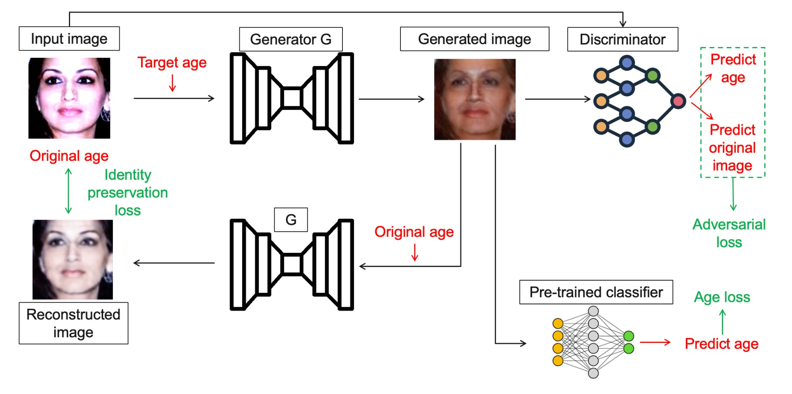

# Conditional Face Aging using GANs

This repository contains the code for our conditional GAN project for face aging. The project consists of three main components:

- **gan.py**: Script to train the conditional GAN.
- **train_classifier.py**: Script to train the pre-trained age classifier (based on ResNet50).
- **test_and_viz.ipynb**: Jupyter Notebook for testing the models and visualizing the results.

## Project Overview

The goal of this project is to develop a conditional GAN that can generate aged versions of a given face image, while preserving the subject's identity. The GAN is conditioned on age, which is discretized into 10 classes (e.g., 0-10, 10-20, ..., 90-100). In addition, a ResNet50-based classifier is trained to predict the age from images and is used to provide additional guidance during GAN training.

## Repository Structure

- `gan.py`: Contains the code for downloading the UTKFace dataset, preprocessing, defining the GAN architecture (Generator and Discriminator), and training the GAN model.
- `train_classifier.py`: Contains the code to train a pre-trained classifier on the UTKFace dataset. This classifier is later used to guide the GAN by predicting the age of generated images and computing an MSE loss with respect to the target age.
- `test_and_viz.ipynb`: A Jupyter Notebook that provides various visualizations of the results, including examples of aged images, comparisons between base and aged images, and quantitative evaluations.

## Architecture

The architecture of our conditional GAN is illustrated below:



- **Generator (G):** The generator integrates convolutional layers, several residual blocks, and deconvolutional layers to restore resolution, while directly injecting the age condition via a one-hot vector.
- **Discriminator (D):** The discriminator features a dual output: an adversarial branch to distinguish real images from generated ones, and a classification branch that predicts the age class.
- **Pre-trained Classifier:** A classifier based on ResNet50 is used as additional guidance by evaluating the age predicted from the generated images and computing an MSE loss relative to the target age.

## Experimental Settings

- **Dataset:** UTKFace (over 20k face images with age annotations) downloaded via KaggleHub.
- **Image Preprocessing:** Images are resized to 224×224 pixels and normalized.
- **Conditional Setup:** Age is discretized into 10 classes corresponding to age intervals (e.g., 0-10, 10-20, ..., 90-100).
- **Training Configuration:**
  - **GAN:** Trained for 40 epochs with a batch size of 4, using the Adam optimizer (learning rate = 1e-4, betas = (0.5, 0.999)).
  - **Classifier:** Based on a pre-trained ResNet50, fine-tuned on UTKFace for age prediction.
  - **Loss Functions:** The training uses a combination of adversarial loss (BCE), classification loss (CrossEntropy), reconstruction loss (L1), and age guidance loss (MSE).
- **Evaluation Metrics:**
  - **FID:** Our model achieved an FID of 114.
  - **MAE:** The Mean Absolute Error between the target ages and the ages predicted by the classifier is measured at 2.56.

## Results

Our experimental results show that while the GAN is capable of generating plausible aged images, there is still room for improvement. The FID is currently higher than state-of-the-art models, indicating that further refinements in model architecture and training strategy could improve image quality. Detailed qualitative and quantitative results are provided in the `test_and_viz.ipynb` notebook.

## How to Run

1. **Train the GAN Model**

   Run the following command to train the GAN:
   ```bash
   python gan.py
